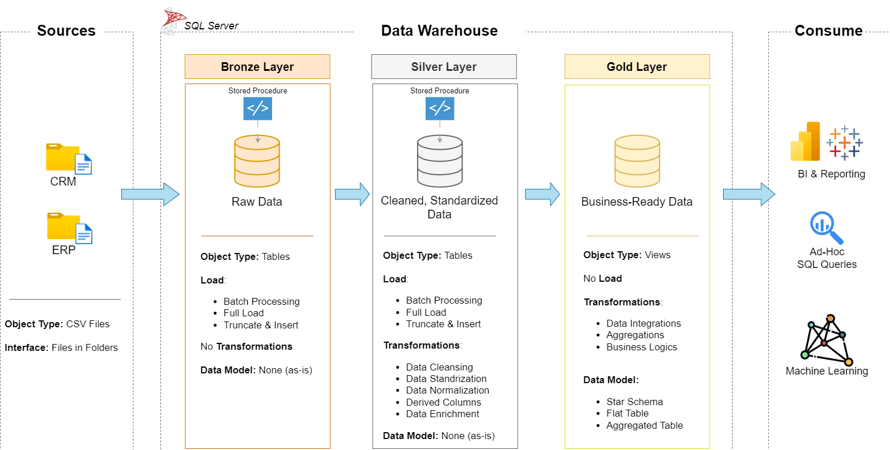

# SQL Data Warehouse — Medallion Architecture

A SQL Server data warehouse built end-to-end from raw CRM and ERP source files to an analytics-ready star schema, using the Medallion (bronze / silver / gold) architecture. The project covers the full pipeline: automated ETL via stored procedures, data quality validation at every layer, and a dimensional model designed for BI reporting.

*Replace with your architecture diagram — bronze/silver/gold flow.*

## What this project demonstrates

- Designing and building a layered data warehouse from scratch (raw files → cleaned → business-ready)
- Writing idempotent, re-runnable DDL and ETL scripts (drop-and-recreate pattern)
- Automating ingestion and transformation with stored procedures, including error handling and execution-time logging
- Diagnosing and resolving real data quality issues (invalid dates, inconsistent categorical values, hidden characters, duplicate records)
- Designing a star schema (fact + dimension tables) with surrogate keys, ready for downstream analytics
- Systematic data validation at each layer, not just at the end

## Tech stack

SQL Server (T-SQL) · Docker · Data Definition Language (DDL) · Stored procedures · Window functions (`ROW_NUMBER`, `LEAD`) · ETL design · Dimensional modelling (star schema) · Data quality testing

## Architecture

This warehouse follows the **Medallion architecture**, moving data through three progressively refined layers:

| Layer | Purpose |
|---|---|
| **Bronze** | Raw, unmodified source data (CRM + ERP CSV exports), loaded as-is for full traceability back to source. |
| **Silver** | Cleaned, standardised, and validated data — deduplicated, type-cast, and business rules applied. |
| **Gold** | Business-ready star schema (fact + dimension views) designed for direct use in reporting/BI tools. |

## Repo structure

| File | Description |
|---|---|
| `01_init_database.sql` | Creates the `first_medallion_wh` database and the bronze/silver/gold schemas. |
| `02_bronze_ddl.sql` | Defines the empty bronze layer tables (raw source structure). |
| `03_bronze_load.sql` | Stored procedure that bulk-loads source CSVs into the bronze tables (full load: truncate + insert), with logging and error handling. |
| `04_bronze_stored_proc_test.sql` | Executes and tests the bronze load procedure. |
| `05_bronze_checks.sql` | Data quality checks on bronze data — primary key integrity, unwanted whitespace, low-cardinality value consistency. |
| `06_silver_ddl.sql` | Defines the empty silver layer tables, including metadata columns (e.g. `dwh_create_date`). |
| `07_silver_load.sql` | Stored procedure that cleans and transforms bronze data into silver — deduplication, standardisation, type casting, derived columns. |
| `08_silver_checks.sql` | Re-runs quality checks against silver data to confirm transformations resolved the issues found in bronze. |
| `09_silver_stored_proc_test.sql` | Executes and tests the silver load procedure. |
| `10_gold_dim_customers.sql` | Builds the `gold.dim_customers` dimension view, integrating CRM + ERP customer data with a surrogate key. |
| `11_gold_dim_products.sql` | Builds the `gold.dim_products` dimension view, filtered to current (active) products only. |
| `12_gold_fact_sales.sql` | Builds the `gold.fact_sales` fact view, linking sales transactions to the dimension tables via surrogate keys. |
| `13_gold_table_checks.sql` | Final data quality validation across the gold layer views. |

## Data model

The gold layer is modelled as a **star schema**:

*Replace with your star schema diagram.*

- **`gold.fact_sales`** — one row per sales order line, with measures (`sales_amount`, `quantity`, `price`) and foreign keys to the dimensions below.
- **`gold.dim_customers`** — customer attributes integrated from CRM (master source) and ERP, with conflicts (e.g. two source gender fields) resolved via `COALESCE`, prioritising the CRM value.
- **`gold.dim_products`** — current (non-historical) product attributes, joined to product category data.

Both dimensions use **surrogate keys** (generated via `ROW_NUMBER()`), rather than exposing source system keys directly — the standard approach for decoupling the warehouse from source system changes.

## Data quality approach

Validation isn't a single step at the end — it happens after each layer:

- **Bronze checks**: are primary keys unique/non-null, are there unwanted spaces, are categorical values consistent?
- **Silver checks**: re-running the same checks post-transformation, to confirm issues were actually resolved (not just moved downstream).
- **Gold checks**: verifying the final fact/dimension views are join-safe and free of duplicates before they're used for reporting.

Some notable issues diagnosed and fixed along the way:
- Bulk insert failures caused by the SQL Server Docker container running on Linux and not having access to local Mac file paths — resolved by remounting the datasets directory as a Docker volume.
- A hidden `\r` (carriage return) character in ERP source fields that silently broke `TRIM()`-based standardisation logic on Mac but not Windows — resolved by explicitly stripping `CHAR(13)` before comparison.
- Overlapping product validity date ranges reconstructed using the `LEAD()` window function.

## Example use cases

With the gold layer in place, this warehouse supports queries such as:
- Total sales by country / customer segment
- Top-performing products by category and subcategory
- Sales trends over time (order date, shipping lead time)

## How to run

1. Spin up SQL Server in Docker, with the `datasets/` folder mounted as a volume (see `03_bronze_load.sql` for the exact mount path used).
2. Run `01_init_database.sql` to create the database and schemas.
3. Run `02_bronze_ddl.sql`, then `03_bronze_load.sql` to load raw source data.
4. Run `06_silver_ddl.sql`, then `07_silver_load.sql` to clean and transform the data.
5. Run `10_gold_dim_customers.sql`, `11_gold_dim_products.sql`, and `12_gold_fact_sales.sql` to build the reporting views.
6. (Optional) Run the `*_checks.sql` scripts at each stage to validate the data.

## Project sequence

1. **Requirements analysis** — understand the business requirements for the warehouse.
2. **Design the data architecture** — choose the data management approach, design the warehouse layers, draw the architecture diagram.
3. **Project initialisation** — define naming conventions, create the database and schemas (`01_init_database`).
4. **Build the bronze layer** — analyse source systems, create empty tables (`02_bronze_ddl`), load and automate ingestion (`03_bronze_load`), test the procedure (`04_bronze_stored_proc_test`), draw the data flow diagram.
5. **Build the silver layer** — validate and understand bronze data (`05_bronze_checks`), draw the data integration diagram, create empty tables (`06_silver_ddl`), transform and load data (`07_silver_load`), test the procedure (`09_silver_stored_proc_test`), validate the results (`08_silver_checks`).
6. **Build the gold layer** — draw the star schema, build the customer dimension (`10_gold_dim_customers`), product dimension (`11_gold_dim_products`), and sales fact (`12_gold_fact_sales`), then validate the final views (`13_gold_table_checks`).
